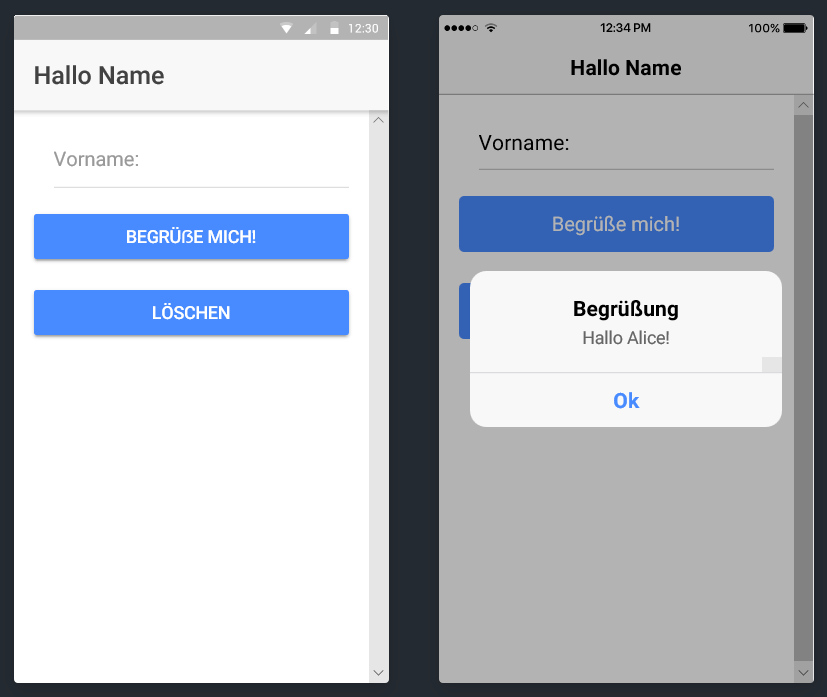

# Ionic-App: Hallo Name #

 

Diese Repository enthält ein [Ionic](https://ionicframework.com/)/Angular-Projekt für eine mobile App,
die die Implementierung eines einfachen Button-Event-Handlers zeigt.

 

----

## Screenshot ##

 

 

----

## License ##

 

See the [LICENSE file](LICENSE.md) for license rights and limitations (BSD 3-Clause License)
for the files in this repository.

 
