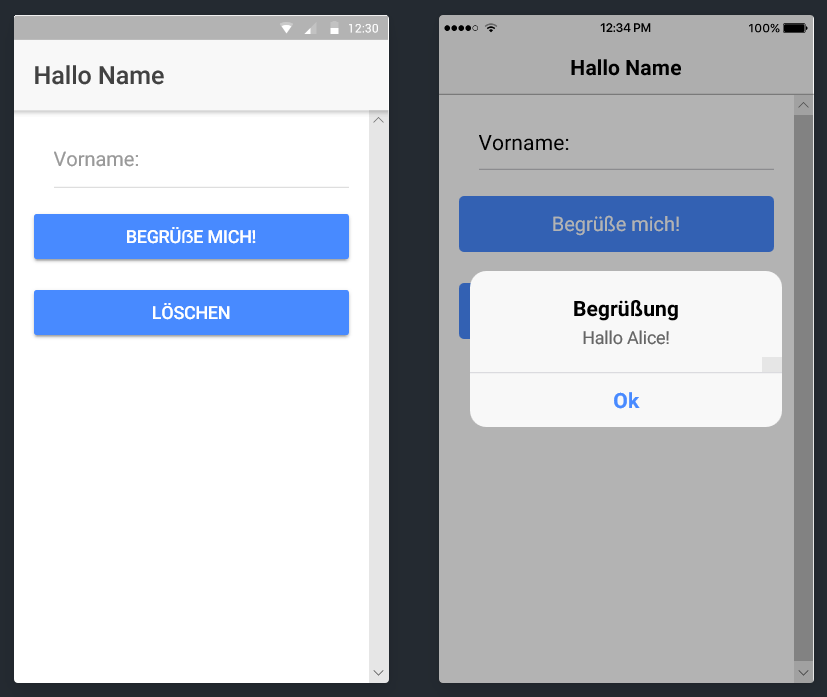

# Ionic app "Hallo Name" #

Simple app with [Ionic 4](https://ionicframework.com) with just one page, which demonstrates how
to implement event handling methods for buttons and how to access the value of a text input element.

 

----
## Screenshots ##

Screenshot was taken from [Ionic Lab](https://blog.ionicframework.com/ionic-lab/). 

 

----
## License ##

See the [LICENSE file](LICENSE.md) for license rights and limitations (BSD 3-Clause License)
for the files in this repository.
